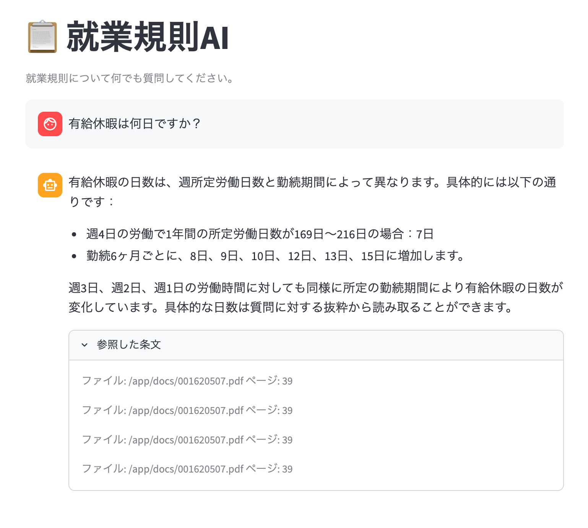

# 就業規則AI

就業規則PDFをベクトルDBに登録し、自然言語で検索・回答するRAGシステムです。



## 動作確認済み環境

- MacBook Pro M5 Pro / 64GB RAM
- Docker Desktop 4.x（メモリ割り当て 20GB 以上を推奨）
- モデル: `qwen2.5:14b-instruct-q4_K_M`

## 構成

```
work-rules-ai/
├── docker-compose.yml
├── .env.example        # .env にコピーして使用
├── .gitignore
├── docs/               # 就業規則PDFを配置（Git管理外）
├── api/
│   ├── Dockerfile
│   ├── requirements.txt
│   ├── config.py       # 環境変数の読み込み
│   ├── ingest.py       # PDF取り込みスクリプト
│   └── main.py         # FastAPI エンドポイント
└── ui/
    ├── Dockerfile
    ├── requirements.txt
    └── app.py          # Streamlit チャットUI
```

### サービス構成

| サービス | 役割 | ポート |
|----------|------|--------|
| Ollama | LLM推論 | 11434 |
| ChromaDB | ベクトルDB | 8001 |
| FastAPI | RAGオーケストレーター | 8000 |
| Streamlit | チャットUI | 8501 |

## セットアップ

### 1. Docker Desktopのメモリ設定

Docker Desktop → Settings → Resources → Memory を **20GB 以上**に設定して Apply & Restart。

> `qwen2.5:14b` はモデルロード時に約10GB使用します。設定が不足するとOOMキルされます。

### 2. 環境変数の設定

```bash
cp .env.example .env
```

必要に応じて `.env` を編集します。主な設定項目：

```bash
LLM_MODEL=qwen2.5:14b-instruct-q4_K_M  # 使用するLLMモデル
CHUNK_SIZE=200                           # チャンクサイズ
CHUNK_OVERLAP=30                         # チャンクオーバーラップ
```

### 3. 就業規則PDFの配置

```bash
cp /path/to/就業規則.pdf docs/
```

### 4. サービス起動

```bash
docker compose up -d
```

### 5. モデルのダウンロード（初回のみ）

```bash
docker compose exec ollama ollama pull qwen2.5:14b-instruct-q4_K_M
```

### 6. PDFの取り込み

```bash
docker compose exec api python ingest.py
```

成功すると以下のように表示されます。

```
PDFを読み込み中...
94 ページを読み込みました。
592 チャンクに分割しました。
ChromaDBへの登録が完了しました。
```

### 7. ブラウザで開く

```bash
open http://localhost:8501
```

## 使い方

チャット欄に就業規則に関する質問を入力すると、該当条文を検索して回答します。
回答下部の「参照した条文」から参照元のページ番号を確認できます。

**質問例**
- 有給休暇は何日ですか？
- 遅刻した場合の扱いはどうなりますか？
- 試用期間は何ヶ月ですか？

## モデルの変更

`.env` の `LLM_MODEL` を変更してAPIを再起動するだけで切り替えられます。

```bash
# モデルをpull
docker compose exec ollama ollama pull qwen2.5:32b-instruct-q4_K_M

# .env を編集
LLM_MODEL=qwen2.5:32b-instruct-q4_K_M

# APIを再起動
docker compose restart api
```

### 64GB RAMで選べるモデル

| モデル | 必要メモリ | 速度 | 日本語 |
|--------|-----------|------|--------|
| `qwen2.5:14b-instruct-q4_K_M` | ~9GB | 速い | ◎ |
| `qwen2.5:32b-instruct-q4_K_M` | ~20GB | 普通 | ◎ |
| `llama3.1:8b` | ~5GB | 爆速 | △ |

## PDFを追加・更新する場合

`docs/` にPDFを追加または置き換えてから再取り込みします。

```bash
docker compose exec api python ingest.py
```

## トラブルシューティング

**`signal: killed` エラーが出る**
Docker DesktopのメモリをOllamaのモデルサイズ+余裕分（+4GB程度）以上に設定してください。

**`No module named 'langchain.text_splitter'` エラーが出る**
`api/` イメージを再ビルドしてください。
```bash
docker compose build api
docker compose up -d
```

**ChromaDBにデータが入っていない**
```bash
docker compose exec api python3 -c "
import chromadb
client = chromadb.HttpClient(host='chromadb', port=8000)
print(client.list_collections())
"
```
`work_rules` が表示されない場合は `ingest.py` を再実行してください。
